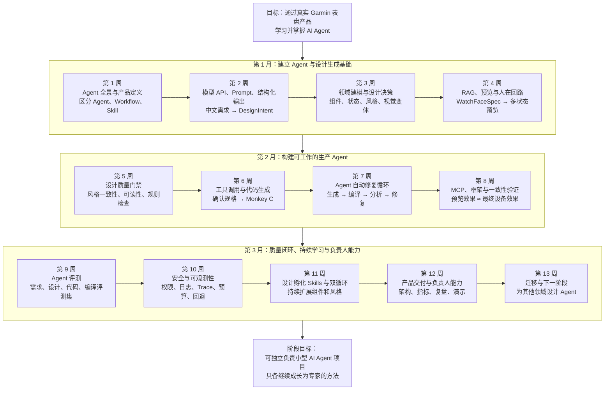
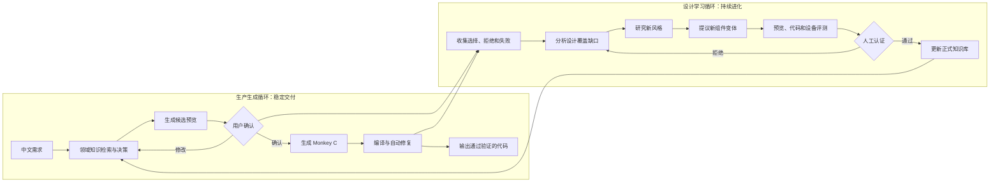
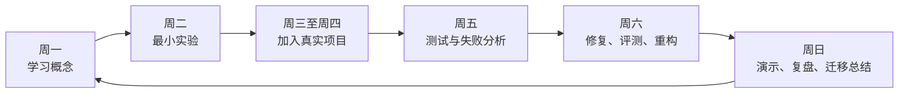
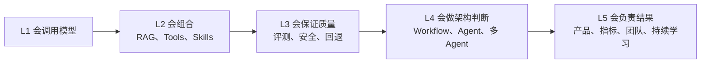

# AI Agent 三个月学习计划图

## 总体路线

```mermaid
flowchart TB
    START["目标：通过真实 Garmin 表盘产品<br/>学习并掌握 AI Agent"] --> M1

    subgraph M1["第 1 月：建立 Agent 与设计生成基础"]
        W1["第 1 周<br/>Agent 全景与产品定义<br/>区分 Agent、Workflow、Skill"]
        W2["第 2 周<br/>模型 API、Prompt、结构化输出<br/>中文需求 → DesignIntent"]
        W3["第 3 周<br/>领域建模与设计决策<br/>组件、状态、风格、视觉变体"]
        W4["第 4 周<br/>RAG、预览与人在回路<br/>WatchFaceSpec → 多状态预览"]
        W1 --> W2 --> W3 --> W4
    end

    subgraph M2["第 2 月：构建可工作的生产 Agent"]
        W5["第 5 周<br/>设计质量门禁<br/>风格一致性、可读性、规则检查"]
        W6["第 6 周<br/>工具调用与代码生成<br/>确认规格 → Monkey C"]
        W7["第 7 周<br/>Agent 自动修复循环<br/>生成 → 编译 → 分析 → 修复"]
        W8["第 8 周<br/>MCP、框架与一致性验证<br/>预览效果 ≈ 最终设备效果"]
        W5 --> W6 --> W7 --> W8
    end

    subgraph M3["第 3 月：质量闭环、持续学习与负责人能力"]
        W9["第 9 周<br/>Agent 评测<br/>需求、设计、代码、编译评测集"]
        W10["第 10 周<br/>安全与可观测性<br/>权限、日志、Trace、预算、回退"]
        W11["第 11 周<br/>设计孵化 Skills 与双循环<br/>持续扩展组件和风格"]
        W12["第 12 周<br/>产品交付与负责人能力<br/>架构、指标、复盘、演示"]
        W13["第 13 周<br/>迁移与下一阶段<br/>为其他领域设计 Agent"]
        W9 --> W10 --> W11 --> W12 --> W13
    end

    M1 --> M2 --> M3
    M3 --> END["阶段目标：<br/>可独立负责小型 AI Agent 项目<br/>具备继续成长为专家的方法"]
```

## 产品双循环

```mermaid
flowchart LR
    subgraph PROD["生产生成循环：稳定交付"]
        U["中文需求"] --> D["领域知识检索与决策"]
        D --> P["生成候选预览"]
        P --> H{"用户确认"}
        H -- "修改" --> D
        H -- "确认" --> C["生成 Monkey C"]
        C --> B["编译与自动修复"]
        B --> O["输出通过验证的代码"]
    end

    subgraph LEARN["设计学习循环：持续进化"]
        F["收集选择、拒绝和失败"] --> G["分析设计覆盖缺口"]
        G --> R["研究新风格"]
        R --> V["提议新组件变体"]
        V --> T["预览、代码和设备评测"]
        T --> A{"人工认证"}
        A -- "通过" --> K["更新正式知识库"]
        A -- "拒绝" --> G
    end

    H --> F
    B --> F
    K --> D
```

## 每周学习循环

```mermaid
flowchart LR
    A["周一<br/>学习概念"] --> B["周二<br/>最小实验"]
    B --> C["周三至周四<br/>加入真实项目"]
    C --> D["周五<br/>测试与失败分析"]
    D --> E["周六<br/>修复、评测、重构"]
    E --> F["周日<br/>演示、复盘、迁移总结"]
    F --> A
```

## 能力成长路径

```mermaid
flowchart LR
    L1["L1 会调用模型"] --> L2["L2 会组合<br/>RAG、Tools、Skills"]
    L2 --> L3["L3 会保证质量<br/>评测、安全、回退"]
    L3 --> L4["L4 会做架构判断<br/>Workflow、Agent、多 Agent"]
    L4 --> L5["L5 会负责结果<br/>产品、指标、团队、持续学习"]
```

三个月目标：稳定达到 L3，并开始具备 L4、L5 的思考和实践证据。

