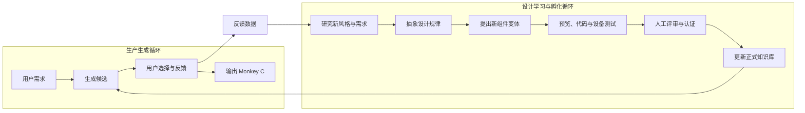

# 持续学习与设计孵化系统

## 为什么需要独立的持续学习系统

生产生成 Agent 只能组合当前已经知道的风格、组件变体和规则。如果知识库长期不更新，
即使生成次数再多，结果也会逐渐重复和过时。

因此系统需要两条相互连接、职责分离的循环：



生产循环追求稳定交付。孵化循环追求持续扩展设计能力。孵化结果只有通过认证后才能影响
生产循环。

## 先做 Skills，还是独立 Agent

### 推荐演进顺序

第一阶段：**Skills + 固定工作流**

- 每个 Skill 处理一个边界明确的任务；
- 人工发起设计研究和变体认证；
- 流程容易测试、理解和控制；
- 适合项目早期和个人开发。

第二阶段：**设计研究 Agent**

- 自动识别组件库的覆盖缺口；
- 规划本轮需要研究的风格或组件；
- 调用 Skills 完成研究、提议和实验；
- 最终仍由人工决定是否认证。

第三阶段：**多 Agent 协作**

- 当研究、实现、评测任务需要并行，且单 Agent 上下文复杂度过高时再拆分；
- 每个 Agent 有明确输入、输出、权限和质量指标；
- 不因为“多 Agent 更先进”而拆分。

## 建议的持续学习 Skills

### Skill 1：设计覆盖分析

目标：找出当前设计系统缺什么。

输入：

- 组件、风格和认证变体目录；
- 用户需求；
- 候选选择、拒绝和修改记录；
- 生成失败记录。

输出：

- 高频但覆盖不足的需求；
- 低接受率组件或风格；
- 缺失的状态、设备或布局组合；
- 下一轮孵化优先级。

示例：

> 卡通风心率组件有大量需求，但当前只有一个认证变体，且用户经常要求更简洁。

### Skill 2：风格研究与抽象

目标：把模糊风格转成可实现的设计系统。

输入：

- 合法设计案例；
- 用户对风格的中文描述；
- 已有风格系统；
- Garmin 设备约束。

输出：

- 风格定义；
- 色板、字体、线宽、圆角、图标和装饰语言；
- 推荐与禁止的组件变体；
- 与已有风格的差异；
- 来源与许可证记录。

它提炼设计规律，不直接复制案例。

### Skill 3：组件变体提议

目标：基于已有绘制原语和风格系统提出新的组件展示方式。

输入：

- 组件语义和状态；
- 目标风格系统；
- 可用绘制原语；
- 目标设备与性能预算；
- 已有变体，避免重复。

输出：

- 新变体配方；
- 可调整参数和约束；
- 状态矩阵；
- Web 与 Monkey C 实现计划；
- 与现有变体的差异说明。

输出默认状态为 `draft`。

### Skill 4：变体实现

目标：将批准实验的变体实现为可预览、可生成的能力。

输出：

- Web 预览渲染器；
- Monkey C 模板或渲染实现；
- 状态测试数据；
- 性能预算；
- 实现说明。

这一 Skill 更偏代码工程，不能只输出设计描述。

### Skill 5：视觉与设备评测

目标：运行自动质量检查和设备验证。

输入：

- 变体定义；
- 状态矩阵；
- 目标设备；
- Web 与 Monkey C 实现。

输出：

- 边界、重叠、对比度和可读性结果；
- Web 与 Monkey C 一致性；
- 模拟器或真机结果；
- 性能和资源结果；
- 是否具备进入人工评审的条件。

### Skill 6：人工评审辅助

目标：为人提供完整、可比较的评审材料，但不替代人工审美判断。

输出：

- 不同状态和设备模式预览矩阵；
- 与已有变体并排对比；
- 自动评测结果；
- 新颖性和重复度；
- 风险与建议。

最终认证由人完成。

### Skill 7：知识发布与回归

目标：将认证变体安全发布到正式知识库。

步骤：

1. 检查认证记录；
2. 更新组件、风格和变体索引；
3. 运行完整回归测试；
4. 更新知识版本；
5. 记录变更说明；
6. 监控上线后的接受率和失败率。

## 设计研究 Agent

在 Skills 稳定之后，可以增加一个离线运行的设计研究 Agent。

它负责：

1. 分析生产反馈和设计覆盖；
2. 选择值得研究的问题；
3. 制定孵化计划；
4. 调用风格研究、变体提议、实现和评测 Skills；
5. 整理候选并提交人工评审；
6. 根据评审结果更新研究记忆。

它不能：

- 自动把新变体加入正式库；
- 绕过版权和来源检查；
- 绕过设备测试；
- 根据一次用户反馈直接改变全局风格规则；
- 自行修改生产 Agent 的核心规则。

## 持续学习学的是什么

这里的“学习”主要不是训练模型权重，而是持续更新：

- 领域知识；
- 风格系统；
- 组件变体；
- 参数范围；
- 用户偏好统计；
- 失败案例；
- 评测集；
- 选择和排序策略。

当累积了大量高质量、已标注数据后，才考虑训练排序模型、偏好模型或微调模型。项目早期
直接微调通常成本高、难评测，也无法替代设计系统。

## 反馈如何转化为知识

一次用户选择不能直接成为规则。反馈需经过聚合：

```text
原始反馈
-> 清洗和分类
-> 找到重复模式
-> 提出设计假设
-> 实验候选
-> A/B 或人工评审
-> 通过后更新知识
```

示例：

- 原始反馈：多名用户都把科技风心率组件中的细小标签删除；
- 假设：小尺寸科技风组件的标签影响可读性；
- 实验：制作无标签和简短标签两个变体；
- 评测：在多设备和多状态下比较；
- 结论：通过后调整变体推荐，不直接修改所有科技风组件。

## 持续学习指标

| 指标 | 说明 |
| --- | --- |
| 设计覆盖率 | 高频需求是否有足够认证变体支持 |
| 新变体认证率 | 提议变体中最终通过认证的比例 |
| 变体孵化周期 | 从发现缺口到认证所需时间 |
| 新变体接受率 | 新变体进入生产后的用户保留比例 |
| 重复变体率 | 新提议是否只是已有变体的轻微重复 |
| 回归失败率 | 知识更新是否破坏已有生成质量 |
| 反馈转化率 | 有价值反馈最终形成改进的比例 |
| 风格覆盖均衡度 | 是否长期只扩展少数风格 |

## 运行节奏

个人项目阶段建议：

- 每周一次覆盖分析；
- 每两周选择一个组件或风格缺口；
- 每轮只孵化 1 至 3 个高质量变体；
- 每月清理低接受率和重复变体；
- 每次知识发布都运行完整回归。

持续学习的目标不是无限增加组件数量，而是持续提高覆盖率、质量和用户接受率。

## 与三个月学习计划的关系

- 第 3 周：定义孵化 Skills、输入输出和首批风格/变体；
- 第 4 至 5 周：每周运行小型设计学习循环，完善预览与质量门禁；
- 第 6 至 10 周：用 Monkey C、设备测试和真实反馈提高认证质量；
- 第 11 周：评估是否将稳定 Skills 编排成设计研究 Agent；
- 第 12 至 13 周：展示生产与持续学习双循环，并制定长期运营计划。
