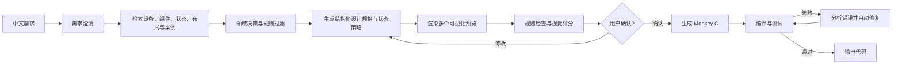

# Garmin 表盘智能生成 Agent

## 双重目标

这个项目不是为了学习 Agent 而制作的演示程序。它必须同时达到两个目标：

1. **产品目标**：真正提高 Garmin 表盘设计和 Monkey C 开发效率，输出达到可用质量的代码；
2. **学习目标**：通过真实质量要求，掌握可迁移的 Agent 设计、评测和工程化能力。

最终交付物仍然是 Monkey C 代码，不包含发布材料。但在输出代码之前，必须通过可视化预览、
用户确认、规则检查和编译验证。

系统还必须具备独立的设计孵化循环，持续发现设计覆盖缺口、研究新风格、提议并认证新组件
变体。生产生成 Agent 只消费经过认证的知识，不能未经审核自动修改自己。

## 产品工作流

用户期望的主流程：

`中文需求 -> 领域知识检索 -> 生成候选设计 -> 预览效果与调整 -> 用户确认 -> 生成 Monkey C -> 编译 -> 分析错误 -> 自动修复 -> 输出代码`



## 核心架构原则：共享设计规格

预览和 Monkey C 生成必须使用同一份结构化设计规格，不能让模型分别生成一张效果图和一份
无关代码。否则预览通过也无法保证最终表盘一致。

```text
中文需求
  -> WatchFaceSpec JSON
      -> Web Preview Renderer（Vue + SVG/Canvas）
      -> Monkey C Code Generator
```

`WatchFaceSpec` 是系统的核心产品资产。它描述：

- 目标设备、分辨率、屏幕技术和 API Level；
- 表盘背景、主题、色板和风格；
- 时间、日期、心率、电量、步数等组件；
- 每个组件的位置、大小、字体、颜色、对齐和显示条件；
- 普通模式与 Always-On 模式；
- 设计来源、规则依据和用户修改记录。

## 领域知识与设计决策

领域知识不是单一向量库，而是由设备、组件、认证组件视觉变体、状态样式、风格系统、设计
模式、硬规则、案例和用户反馈组成的混合知识系统。

设计决策按以下顺序执行：

1. 将中文需求解析为用户目标、风格、必选组件、可选组件和优先级；
2. 精确查询设备能力和组件目录，过滤不支持的组件与效果；
3. 根据用户要求、场景相关性、可读性、视觉成本、功耗和数据风险对组件评分；
4. 根据屏幕形状、信息层级和组件数量选择布局模式；
5. 为每个组件检索与目标风格匹配的认证视觉变体；
6. 制定候选差异计划，在允许参数范围内产生丰富变化；
7. 使用风格令牌、组件语义、数据状态和显示模式逐层决定样式；
8. 为每个组件生成运行时状态与降级策略；
9. 生成候选规格并通过硬规则检查；
10. 保存每个选择和省略的理由，接受用户反馈后调整。

详细设计见：

- [领域知识检索与设计决策](领域知识检索与设计决策.md)
- [领域知识库结构](领域知识库结构.md)
- [组件视觉变体与风格系统](组件视觉变体与风格系统.md)
- [组件变体质量门禁](组件变体质量门禁.md)
- [持续学习与设计孵化系统](持续学习与设计孵化系统.md)
- [Skills 设计清单](Skills设计清单.md)
- [架构决策：持续学习使用 Skills 优先](架构决策-持续学习使用Skills优先.md)

## 为什么预览优先

- 用户在生成代码前就能发现布局、颜色和信息层级问题；
- 一份规格可以批量产生多个候选设计；
- 确认后的规格可以作为生成代码的明确验收标准；
- 视觉问题与代码问题分开定位；
- 减少无价值的模型调用、代码生成和编译。

预览应优先使用确定性的 SVG 或 Canvas 渲染，而不是 AI 图片生成。AI 图片可用于灵感探索，
但不能作为代码生成结果的准确预览。

网页预览也不能百分之百复现 Garmin 设备的字体、资源转换和渲染行为。它是高效率的设计
确认工具；代码生成后的 Connect IQ 模拟器或真机效果才是最终视觉验收依据。

## 四层质量门禁

### 门禁 1：需求质量

进入设计前必须明确：

- 目标设备或设备组；
- 屏幕技术与分辨率；
- 表盘风格和色彩偏好；
- 必须展示的数据字段及优先级；
- 普通模式和 Always-On 要求；
- 用户不接受的设计。

需求不完整时，Agent 应提问或使用明确默认值，不能静默猜测。

### 门禁 2：设计与预览质量

候选预览必须检查：

- 信息层级是否清楚，时间是否一眼可见；
- 文本和背景对比度；
- 元素是否重叠、越界或距离圆屏边缘过近；
- 字体在目标分辨率下是否可读；
- 数据字段是否符合需求；
- 多个候选方案是否有真实布局或风格差异；
- Always-On 预览是否满足相应约束。

用户确认预览后，设计规格锁定版本，才允许生成 Monkey C。

### 门禁 3：代码与设备质量

- Monkey C 语法和类型检查；
- API 是否受目标设备和 API Level 支持；
- 代码是否忠实实现已确认的设计规格；
- 普通模式、低功耗模式和 Always-On 模式逻辑；
- 资源、内存和绘制性能风险；
- Connect IQ SDK 编译通过。

### 门禁 4：最终一致性

- 最终代码必须使用 Connect IQ 模拟器或真机重新生成实际效果；
- 与确认预览进行布局和关键属性对比；
- 差异超出阈值时不得输出为成功；
- 差异需要改变设计规格时，必须返回用户重新确认；
- 保存需求、规格、预览确认、代码和验证报告的关联关系。

## Agent 与确定性程序的职责

| 能力 | Agent/模型负责 | 确定性程序负责 |
| --- | --- | --- |
| 需求理解 | 理解模糊描述、提出澄清问题 | Schema 校验、默认值检查 |
| 领域知识 | 选择需要检索的知识、解释规则 | 检索、过滤、版本管理 |
| 设计 | 提出布局、色板和候选方案 | 边界、重叠、对比度等检查 |
| 预览 | 根据反馈修改设计规格 | SVG/Canvas 精确渲染 |
| 代码 | 生成或修复有限 Monkey C 代码块 | 模板生成、文件写入、静态检查 |
| 验证 | 分析错误并决定修复方式 | 编译、测试、差异比较 |

## 产品范围

第一版聚焦：

- 2 至 3 款圆形 AMOLED 设备；
- 数字表盘；
- 时间、日期、心率、电量、步数；
- 3 至 5 种经过人工设计的基础布局；
- 普通模式和 Always-On 模式；
- 中文需求、候选预览、确认后生成 Monkey C；
- 自动规则检查、编译和有限次数自动修复。
- 正式生成与探索生成分离，实验变体通过认证后才能进入正式库。

暂不支持：

- 所有 Garmin 设备；
- 完全自由布局和任意资源；
- 模拟指针表盘；
- 自动发布或发布材料；
- 无限制自动修复。

## 技术栈

- 前端与预览：Vue 3 + Vite + JavaScript，SVG 或 Canvas；
- Agent 服务：Node.js + JavaScript；
- 目标代码：Garmin Monkey C；
- 核心规格：版本化 JSON Schema；
- 领域知识：结构化 JSON、规则引擎、Markdown 文档与语义检索组成的混合知识系统；
- 验证工具：Connect IQ SDK 的 `monkeyc`、`monkeydo` 和模拟器；
- Agent 工具：需求校验、设备查询、规则检查、预览渲染、代码生成、编译和测试。

安装 Connect IQ SDK 或任何 npm 包前需要用户授权。

## 版本路线

| 版本 | 产品成果 | Agent 学习重点 |
| --- | --- | --- |
| v0.1 | 组件、状态、布局和设备知识目录 | 领域建模与结构化知识 |
| v0.2 | 风格系统和认证组件变体库 | 受控生成与质量认证 |
| v0.3 | 中文需求生成带决策证据的 `WatchFaceSpec` | 结构化输出与混合检索 |
| v0.4 | 规格驱动候选预览、修改和用户确认 | 确定性渲染、人在回路与状态管理 |
| v0.5 | 设计案例语义检索、反馈排序和规则检查 | RAG 与 Guardrail |
| v0.6 | 确认规格生成 Monkey C | 上下文工程与代码生成 |
| v0.7 | 调用编译器、分析错误和有限自动修复 | 工具调用、工作流与 Agent 循环 |
| v0.8 | 最终代码与预览一致性检查 | 多模态评测与质量门禁 |
| v0.9 | 设计覆盖分析、变体孵化 Skills 和知识发布回归 | 持续学习与离线 Agent |
| v1.0 | 稳定生产流程与持续设计孵化双循环 | 负责人能力与产品交付 |

## 产品质量指标

### 北极星指标

**人工可接受代码率**：用户确认预览后，最终输出无需大改即可继续开发或使用的 Monkey C
代码比例。

视觉审美不能完全由自动规则或模型评分替代。自动检查负责淘汰明显错误，用户确认和最终
人工验收负责判断设计是否真正值得使用。

### 分层指标

| 阶段 | 指标 |
| --- | --- |
| 需求 | 需求完整率、澄清成功率 |
| 设计 | 首轮预览接受率、平均修改轮数、视觉规则通过率 |
| 组件变体 | 认证变体数量、变体人工接受率、Web 与 Monkey C 一致率 |
| 风格 | 候选内部风格一致率、目标风格识别率 |
| 一致性 | 确认预览与最终实现一致率 |
| 代码 | 首次编译成功率、最终编译成功率、规则通过率 |
| 效率 | 从需求到确认预览耗时、从确认到代码输出耗时 |
| 成本 | 每个被接受结果的模型调用成本 |
| 批量质量 | 候选差异有效率、候选重复率、批量结果人工保留率 |
| 持续学习 | 设计覆盖率、新变体接受率、孵化周期、知识回归失败率 |

## 最终演示

1. 输入真实中文需求并选择目标设备；
2. Agent 检索领域规则，必要时提出澄清问题；
3. 生成多个候选预览，并展示视觉规则检查；
4. 用户选择一个预览并要求修改；
5. 用户确认后生成 Monkey C；
6. 自动编译，展示一次错误分析与修复；
7. 对比确认预览与最终实现；
8. 输出通过全部质量门禁的 Monkey C 代码和验证结果。
