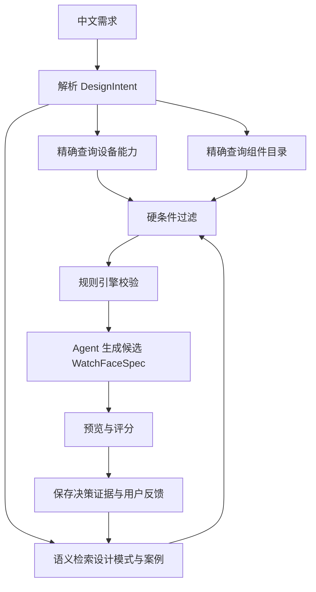

# 领域知识检索与设计决策

## 核心结论

“领域知识检索”不只是搜索 Garmin 官方文档。为了决定展示哪些组件、如何布局、不同状态
如何显示，系统需要四种不同能力：

1. **结构化查询**：精确回答设备支持什么、组件需要什么数据、有哪些状态；
2. **规则引擎**：判断哪些选择不允许，以及必须如何降级；
3. **语义检索**：从风格模式、优秀案例和设计经验中寻找适合当前需求的参考；
4. **Agent 决策**：结合用户需求、查询结果、规则和案例，生成有依据的候选设计。

不能把所有知识都塞进向量库。设备 API Level、组件兼容性、颜色值和布局边界必须使用
结构化数据与确定性规则。

## 领域知识的六个知识库

其中，设备能力和平台限制主要来自 Garmin 官方资料；组件优先级、布局模式、视觉风格和
状态表达需要由产品团队人工设计、验证并持续根据用户反馈改进。官方文档不能替代产品设计
知识，模型自身审美也不能替代人工认可的设计系统。

### 1. 设备知识库

回答“这个设备能做什么”：

- 屏幕宽高、形状、屏幕技术和安全区域；
- API Level 和可用 API；
- 是否支持 Always-On、烧屏规则和低功耗限制；
- 支持的字体、颜色能力、内存和资源限制；
- 推荐布局密度和最小可读尺寸。

查询方式：按设备 ID 或设备组精确查询，不使用模糊语义检索作为最终依据。

### 2. 组件知识库

回答“有哪些组件、组件表达什么、什么时候适合展示”：

- 组件类型：时间、日期、电量、心率、步数、卡路里等；
- 用户价值：核心信息、健康信息、状态提示还是装饰；
- 数据来源、更新频率、可用条件和 API 要求；
- 默认优先级、视觉占用、适合的位置；
- 支持的显示形式，例如数字、图标、进度环、文本；
- 数据缺失、过期、异常和阈值触发时如何显示。

查询方式：按组件 ID 精确查询，再按用户目标、设备和可用面积进行评分。

### 3. 状态与样式知识库

回答“同一组件在不同情况下怎么显示”。

状态至少分为三层：

| 状态层 | 示例 | 影响 |
| --- | --- | --- |
| 设备显示状态 | active、low-power、always-on | 可用颜色、更新频率、显示组件数量 |
| 数据状态 | normal、unavailable、stale、warning、critical | 文本、图标、颜色和降级方式 |
| 用户目标状态 | goal-progress、goal-achieved | 是否强调、是否使用庆祝效果 |

例如电量组件：

- 正常：使用主题次要颜色；
- 低电量：使用警告色并提高视觉优先级；
- 严重低电量：使用危险色；
- Always-On：避免高亮大面积填充，只保留简化图标或数字。

查询方式：使用结构化状态表和优先级规则，不让模型临时发明状态。

设计阶段不知道手表运行时的实际电量、心率或数据是否过期。因此系统不是只生成一张“正常
状态”预览，而是为每个组件生成完整状态策略。预览器允许切换状态，Monkey C 在运行时根据
真实数据选择对应样式。

例如心率组件至少应预览：

- Active + normal；
- Active + stale；
- Active + unavailable；
- Always-On + normal；
- Always-On + unavailable。

缺少状态设计的组件不能进入代码生成。

### 4. 设计模式知识库

回答“这些组件如何组合才合理”：

- 布局模式：中心时间、上下分区、环形数据、四象限等；
- 适用屏幕形状和组件数量；
- 主组件、次组件和辅助组件的槽位；
- 推荐字号比例、留白、对齐和视觉层级；
- 不适合的情况；
- 普通模式与 Always-On 的配套设计。

查询方式：先按设备形状、组件数量、信息层级过滤，再用语义检索匹配“极简、运动、信息
密集”等风格。

### 4.1 组件视觉变体库

回答“这个组件在目标风格中具体长什么样，以及有哪些高质量变化”：

- 运动风、科技风、卡通风等兼容风格；
- 使用的绘制原语和 Monkey C 模板；
- 可调整参数及允许范围；
- 状态和设备模式表现；
- 适用尺寸、槽位和设备；
- 认证状态、质量评分和用户接受数据。

正式候选默认只使用已认证变体。Agent 可以提出实验性变体，但必须经过质量门禁才能进入
正式库。详细设计见 [组件视觉变体与风格系统](组件视觉变体与风格系统.md)。

### 5. 规则与约束知识库

回答“哪些方案不允许或风险很高”：

- Garmin API 与设备兼容规则；
- AMOLED、Always-On、烧屏和功耗规则；
- 圆形屏幕安全区域、重叠、越界和最小可读尺寸；
- 颜色对比度、字段必选和状态降级规则；
- 代码模板与组件实现限制。

查询方式：确定性规则引擎。规则必须带来源、版本和严重级别。

### 6. 案例与反馈知识库

回答“过去哪些设计被用户接受或拒绝”：

- 高质量设计规格和预览；
- 对应用户需求、设备和风格；
- 人工评分、选择结果和拒绝原因；
- 修改记录；
- 最终模拟器或真机效果。

查询方式：语义检索相似需求和风格，并用结构化过滤保证设备与组件范围相符。

## 组件选择如何做出判断

### 第一步：需求转设计意图

Agent 先把中文需求转成 `DesignIntent`：

```json
{
  "audience": "跑步用户",
  "style": ["深色", "极简", "运动"],
  "mustHaveComponents": ["time", "heartRate", "battery"],
  "optionalComponents": ["steps", "date"],
  "informationDensity": "low",
  "priorities": {
    "time": 1,
    "heartRate": 2,
    "battery": 3
  },
  "alwaysOnRequired": true
}
```

需求冲突或缺失时先澄清。例如“极简”但要求展示十个数据字段，Agent 应要求用户选择优先级，
不能直接把所有字段塞进表盘。

### 第二步：筛选可行组件

使用确定性条件过滤：

- 目标设备和表盘类型是否支持所需数据；
- 目标 API Level 是否可用；
- 当前产品版本是否已实现该组件；
- Always-On 模式是否有对应降级样式；
- 数据不可用时是否有合理 fallback。

不满足硬条件的组件不得进入候选。

### 第三步：组件评分

对可行组件计算选择分数。示例：

```text
组件得分 =
  用户明确要求权重
  + 场景相关性
  + 快速可读性
  + 历史用户接受度
  - 视觉面积成本
  - 功耗与更新成本
  - 数据不可用风险
```

第一版不需要复杂机器学习，可以使用可解释的加权规则。每次选择都记录各项分数。

### 第四步：确定信息层级

- 主组件：通常是时间，占据最大视觉面积；
- 次组件：用户明确关心的数据，例如心率；
- 辅助组件：电量、日期等状态信息；
- 可省略组件：与“极简”目标冲突的低优先级字段。

信息层级决定布局槽位、字号、颜色和更新策略。

## 布局与视觉样式如何选择

### 布局选择

布局不是由模型自由给坐标。推荐过程：

1. 按屏幕形状和设备安全区域过滤布局模式；
2. 按主、次、辅助组件数量过滤；
3. 按用户风格和信息密度检索合适模式；
4. 将组件分配到布局定义的槽位；
5. 允许 Agent 对槽位参数做有限调整；
6. 使用规则检查越界、重叠和视觉平衡。

### 组件视觉变体选择

1. 根据组件 ID、目标风格、设备和显示模式检索认证变体；
2. 根据槽位大小、信息层级和状态需求过滤；
3. 对候选变体按风格匹配、可读性、历史接受度、性能成本评分；
4. 检查同一候选内的变体是否共享字体、图标、线宽和圆角语言；
5. 为多个候选制定明确差异计划；
6. 只在变体声明的允许参数范围内调整。

风格系统决定整体设计语言，组件变体决定具体表达方式。只换色板不能算完整的风格变化。

### 颜色选择

颜色由“主题色板 + 语义色 + 状态覆盖”三层组成：

```text
最终颜色 =
  主题默认颜色
  -> 组件语义颜色
  -> 数据状态覆盖
  -> 设备显示状态降级
```

示例：

- 心率正常：主题强调色；
- 心率数据过期：次要灰色；
- 电量低：警告色；
- Always-On：降为低亮度安全色。

状态覆盖必须由规则控制，不能只让模型凭审美选择。

### 多状态冲突如何处理

同一组件可能同时处于多个状态，例如“电量严重不足 + Always-On”。样式合并必须有固定
优先级：

1. 设备硬性安全限制；
2. 数据不可用与 fallback；
3. critical、warning 等数据状态；
4. 用户目标状态；
5. 组件默认语义样式；
6. 主题基础样式。

上层可以覆盖下层。例如电量 critical 原本使用危险色，但 Always-On 安全规则可能要求使用
更低亮度的危险色或简化表现，不能使用不符合设备约束的大面积高亮。

### 效果选择

效果需要考虑：

- 设备显示状态是否允许；
- 更新频率和功耗；
- 是否影响一眼可读性；
- 是否与用户要求的风格一致；
- 是否在产品已支持的渲染能力内。

第一版应限制效果集合，例如无效果、轻量强调、进度环，不支持任意动画。

## 混合检索流程



### 一次检索实际会发出什么请求

以“圆形 AMOLED、极简跑步、时间 + 心率 + 电量”为例：

1. `getDeviceProfile(deviceId)`：取得设备硬事实；
2. `listFeasibleComponents(deviceId, "active")`：取得 Active 可用组件；
3. `listFeasibleComponents(deviceId, "alwaysOn")`：取得 Always-On 可用组件；
4. `getComponentDefinition("heartRate")`：取得心率语义、数据与状态；
5. `getComponentStateStyle("heartRate", "unavailable", "active")`：取得缺失降级；
6. `listCertifiedVariants("heartRate", "sport", deviceId, "active")`：取得认证展示变体；
7. `findLayoutPatterns("round", ["primary", "secondary", "supporting"], ["minimal", "sport"])`；
8. `findSimilarAcceptedDesigns(designIntent)`：检索相似已接受案例；
9. `proposeCandidateDifferencePlan(...)`：规划候选的有效差异；
10. `evaluateDesignRules(candidateSpec)`：应用硬规则；
11. Agent 综合结果，生成候选并写下 `DecisionTrace`。

模型不能跳过前 10 步，直接凭常识输出规格。

## 每个设计必须保存决策证据

不要只保存最终规格。保存 `DecisionTrace`：

```json
{
  "selectedComponents": [
    {
      "id": "heartRate",
      "reason": "用户明确要求，且与跑步场景高度相关",
      "score": 92,
      "variantId": "heart-rate-icon-number-sport",
      "evidence": ["component:heartRate:v1", "intent:must-have"]
    }
  ],
  "omittedComponents": [
    {
      "id": "steps",
      "reason": "用户要求极简，且优先级低于心率和电量"
    }
  ],
  "layout": {
    "id": "center-time-bottom-stats",
    "reason": "适合圆屏、一个主组件和两个次组件"
  },
  "stateRules": [
    "battery-low-warning",
    "heart-rate-unavailable-fallback",
    "amoled-always-on-simplify"
  ]
}
```

这使系统可以回答“为什么展示这些组件、为什么使用这个颜色”，也便于评测和修正。

## RAG 与规则引擎的边界

| 问题 | 应使用 |
| --- | --- |
| 某设备分辨率是多少 | 结构化设备查询 |
| 某 API 是否支持 | 结构化查询 + 官方来源 |
| Always-On 是否允许某效果 | 规则引擎 |
| 极简运动风适合什么布局 | 语义检索 + Agent 判断 |
| 科技风电量具体显示成什么样 | 认证组件变体查询 + Agent 排序 |
| 如何生成丰富但一致的候选 | 差异计划 + 受控参数组合 |
| 用户过去更喜欢哪个候选 | 反馈数据查询 |
| 为什么最终选择心率组件 | Agent 决策证据 |

## 第一版实现顺序

1. 先手工建立 5 个组件、每个核心组件 2 至 3 个认证变体、3 个布局、2 个设备组和关键状态规则；
2. 使用 JSON 查询和规则函数实现，不急着上向量数据库；
3. 做出可解释的组件选择与预览；
4. 收集真实用户选择和拒绝原因；
5. 再为设计案例和长文档加入 Embedding 与语义检索；
6. 用评测数据决定是否需要更复杂的推荐或排序模型。

## 知识来源与负责人

| 知识类型 | 主要来源 | 谁负责确认 |
| --- | --- | --- |
| 设备、API、功耗限制 | Garmin 官方文档与 SDK | 开发负责人 |
| 组件数据与状态 | Garmin API + 产品定义 | 开发与产品 |
| 布局、字体、颜色、效果与组件变体 | 人工设计系统与优秀案例 | 设计或产品负责人 |
| 用户偏好 | 真实选择、拒绝和修改记录 | 产品负责人 |
| 代码实现模式 | 已验证 Monkey C 模板 | 开发负责人 |
